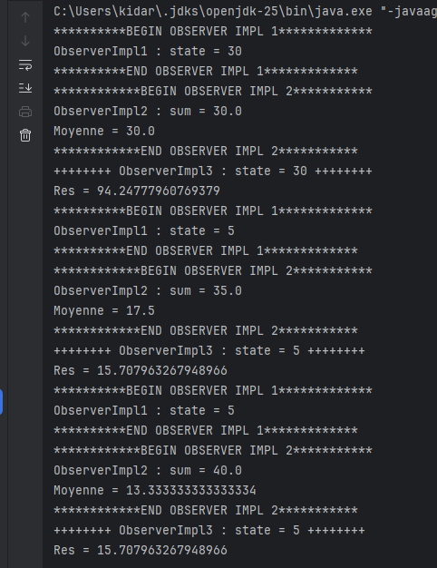
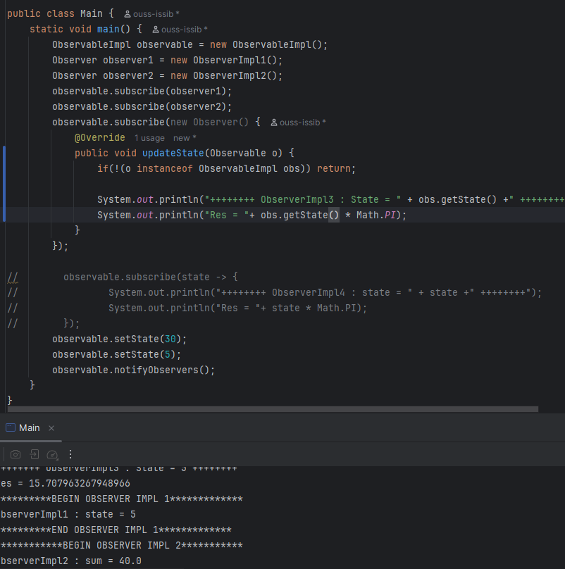

# 🧩 Activité Pratique - Implémentation du Design Pattern **Observer** en Java

Ce dépôt contient une implémentation pratique du **Design Pattern Observer** en Java. Cette activité fait partie du cours de **Design Patterns** encadré par **Mr YOUSSFI Mohamed**.

## 📘 Aperçu du projet

### Design Pattern Observer
- **Objectif** : Illustrer la mise en œuvre du design pattern **Observer** en Java, permettant de créer une relation *one-to-many* entre objets. Lorsqu’un objet observé change d’état, tous les observateurs sont automatiquement notifiés et mis à jour.
- **Technologies utilisées** :
  - `Java` pour la logique orientée objet.
  - Aucune dépendance externe, compatible avec tout IDE Java.

## 🧱 Structure du projet

### Packages principaux
- **obs** : contient les interfaces `Observable` et `Observer`.
  - `Observable` → méthodes `subscribe()`, `unsubscribe()`, `notifyObservers()`
  - `Observer` → méthode unique `updateState()`
- **impl** : contient les classes concrètes :
  - `ObserverImpl` → affichage simple.
  - `ObserverImpl1` → affichage textuel.
  - `ObserverImpl2` → calcul de la somme et de la moyenne d’un historique.

## ⚙️ Fonctionnalités principales
1. Gestion dynamique des abonnements (`subscribe`, `unsubscribe`).
2. Notification automatique des observateurs.
3. Trois implémentations démontrant différents comportements : affichage, message et calculs.
4. Illustration du principe de faible couplage entre objets.

## 🧩 Schéma de fonctionnement
| Push | Pop(Pull) |
|---|---|---|---|---|
|||
| Technique de Push | Technique de pull | 

## 🚀 Comment Exécuter
```bash
git clone https://github.com/ouss-issib/design-pattern-observer-java.git
cd design-pattern-observer-java
mvn clean install
mvn javafx:run

